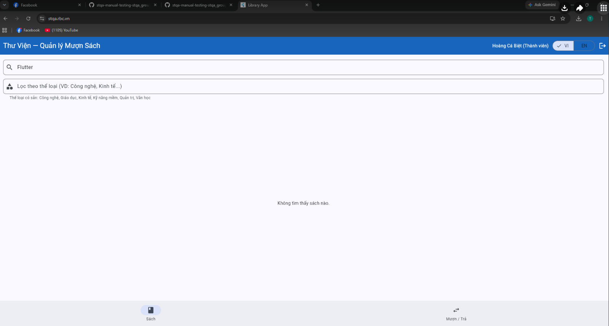
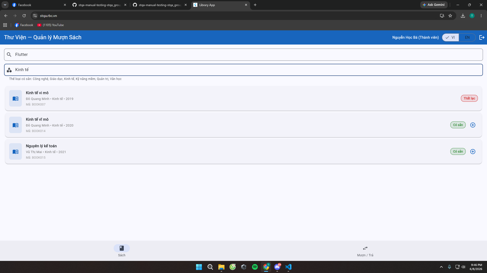
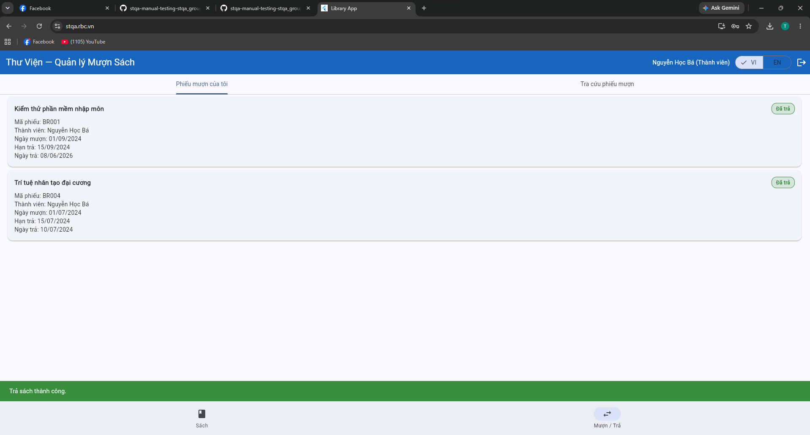
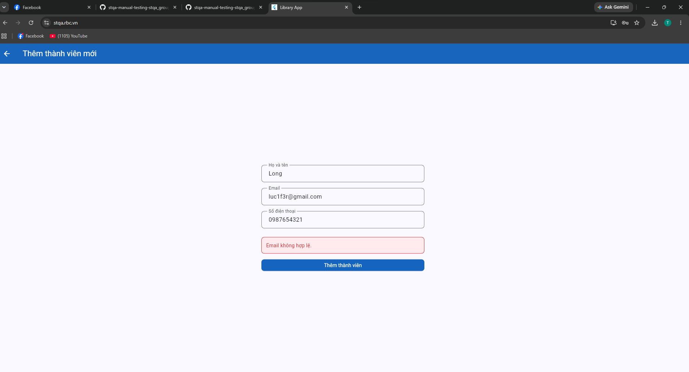
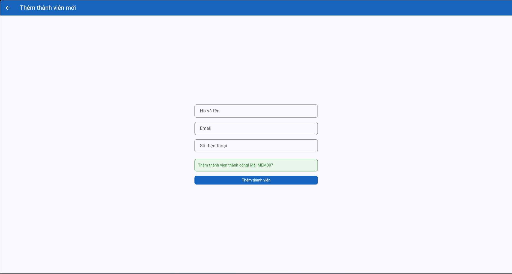

# Bug Reports — Báo cáo lỗi

| Thông tin | |
|---|---|
| **Nhóm** | `Group 25` |
| **Ngày báo cáo** | `08/06/2026` |

---

## BUG-01: Hệ thống không tự động cắt khoảng trắng (trim) khi tìm kiếm, dẫn đến lỗi không tìm thấy sách

| Thuộc tính | Chi tiết |
|-----------|---------|
| **Mã lỗi** | BUG-01 |
| **TC liên quan** | TC-10 |
| **REQ liên quan** | REQ-03 |
| **Mức độ** | Medium |
| **Người phát hiện** | Trần Ngọc Quang Minh |
| **Ngày phát hiện** | 01/06/2026 |
| **Trạng thái** | Open |

**Tiêu đề:**
BUG-01: Hệ thống không tự động cắt khoảng trắng (trim) khi tìm kiếm, dẫn đến lỗi không tìm thấy sách

**Môi trường:**
- Trình duyệt: Chrome (Phiên bản mới nhất)
- Hệ điều hành: Windows 11
- Ngôn ngữ giao diện: Tiếng Việt

**Điều kiện tiên quyết:**
Đã đăng nhập thành công vào hệ thống. Đang ở tab "Sách".

**Bước tái hiện:**
1. Nhấp chuột vào ô tìm kiếm.
2. Nhập từ khóa có chứa khoảng trắng ở cuối: `"Flutter    "`
3. Nhấn nút "Tìm kiếm" (hoặc Enter).

**Kết quả mong đợi:**
Hệ thống tự động cắt bỏ khoảng trắng thừa ở hai đầu từ khóa (hàm `trim()`) và tìm ra sách BOOK001 (Lập trình Flutter cơ bản).

**Kết quả thực tế:**
Hệ thống không tìm thấy sách.

**Tác động:**
Trải nghiệm người dùng kém. Người dùng có thói quen copy/paste từ khóa thường bị dính khoảng trắng thừa và sẽ nghĩ thư viện không có sách đó.

**Minh chứng:**

**Đề xuất xử lý:**
Bổ sung hàm `.trim()` vào biến lưu trữ giá trị của ô input tìm kiếm trước khi gọi API hoặc filter dữ liệu.

---

## BUG-02: Xung đột điều kiện Lọc và Tìm kiếm - Hệ thống ưu tiên hiển thị theo bộ lọc, bỏ qua từ khóa tìm kiếm

| Thuộc tính | Chi tiết |
|-----------|---------|
| **Mã lỗi** | BUG-02 |
| **TC liên quan** | TC-14 |
| **REQ liên quan** | REQ-03 |
| **Mức độ** | Medium |
| **Người phát hiện** | Lưu Gia Nam |
| **Ngày phát hiện** | 01/06/2026 |
| **Trạng thái** | Open |

**Tiêu đề:**
BUG-02: Xung đột điều kiện Lọc và Tìm kiếm - Hệ thống ưu tiên hiển thị theo bộ lọc, bỏ qua từ khóa tìm kiếm

**Môi trường:**
- Trình duyệt: Chrome (Phiên bản mới nhất)
- Hệ điều hành: Windows 11
- Ngôn ngữ giao diện: Tiếng Việt

**Điều kiện tiên quyết:**
Đã đăng nhập thành công. Đang ở tab "Sách".

**Bước tái hiện:**
1. Nhập từ khóa `"Flutter"` vào ô Tìm kiếm.
2. Tại ô Lọc thể loại, chọn `"Kinh tế"`.
3. Quan sát kết quả hiển thị.

**Kết quả mong đợi:**
Hiển thị thông báo "Không tìm thấy sách nào" do sách Flutter không thuộc nhóm Kinh tế (điều kiện AND không thỏa mãn).

**Kết quả thực tế:**
Hệ thống vẫn tìm thấy và hiển thị danh sách các sách thuộc nhóm kinh tế, bỏ qua từ khóa "Flutter".

**Tác động:**
Lỗi logic cơ bản trong việc kết hợp các tiêu chí truy vấn, gây sai lệch kết quả tra cứu của người dùng.

**Minh chứng:**

**Đề xuất xử lý:**
Kiểm tra lại logic hàm filter kết hợp. Đảm bảo dữ liệu đầu ra phải thỏa mãn đồng thời cả 2 điều kiện `Search` VÀ `Category`.

---

## BUG-03: Hệ thống không hiển thị cảnh báo quá hạn khi thành viên thực hiện trả sách muộn

| Thuộc tính | Chi tiết |
|-----------|---------|
| **Mã lỗi** | BUG-03 |
| **TC liên quan** | TC-21 |
| **REQ liên quan** | REQ-05 |
| **Mức độ** | High |
| **Người phát hiện** | Cấn Phú Thanh Long |
| **Ngày phát hiện** | 01/06/2026 |
| **Trạng thái** | Open |

**Tiêu đề:**
BUG-03: Hệ thống không hiển thị cảnh báo quá hạn khi thành viên thực hiện trả sách muộn

**Môi trường:**
- Trình duyệt: Chrome (Phiên bản mới nhất)
- Hệ điều hành: Windows 11
- Ngôn ngữ giao diện: Tiếng Việt

**Điều kiện tiên quyết:**
Đăng nhập tài khoản `ba.nguyen@email.com`. Vào tab Mượn/Trả, có tồn tại phiếu mượn BR001 đã quá hạn.

**Bước tái hiện:**
1. Chuyển sang tab "Mượn/Trả".
2. Tìm đến phiếu mượn BR001 (Quá hạn).
3. Nhấn nút "Trả sách".

**Kết quả mong đợi:**
Sách BOOK003 được cập nhật trạng thái về "Có sẵn", đồng thời hệ thống phải hiển thị cảnh báo trả sách quá hạn (để xử lý phạt).

**Kết quả thực tế:**
Hệ thống chỉ báo trả sách thành công, không hề xuất hiện cảnh báo quá hạn nào.

**Tác động:**
Nghiêm trọng đối với quy trình quản lý của Thủ thư, thư viện có nguy cơ thất thoát khoản phí phạt quá hạn do hệ thống không cảnh báo.

**Minh chứng:**

**Đề xuất xử lý:**
Bổ sung logic check `dueDate < currentDate` tại hàm xử lý button "Trả sách" để hiển thị modal cảnh báo trước khi hoàn tất thủ tục trả.

---

## BUG-04: Thêm thành viên thất bại, hệ thống báo lỗi "Email không hợp lệ" dù nhập đúng định dạng

| Thuộc tính | Chi tiết |
|-----------|---------|
| **Mã lỗi** | BUG-04 |
| **TC liên quan** | TC-24 |
| **REQ liên quan** | REQ-07 |
| **Mức độ** | High |
| **Người phát hiện** | Lê Huy Quang |
| **Ngày phát hiện** | 01/06/2026 |
| **Trạng thái** | Open |

**Tiêu đề:**
BUG-04: Thêm thành viên thất bại, hệ thống báo lỗi "Email không hợp lệ" dù nhập đúng định dạng

**Môi trường:**
- Trình duyệt: Chrome (Phiên bản mới nhất)
- Hệ điều hành: Windows 11
- Ngôn ngữ giao diện: Tiếng Việt

**Điều kiện tiên quyết:**
Đăng nhập bằng tài khoản Thủ thư. Đang mở giao diện quản lý và thêm thành viên mới.

**Bước tái hiện:**
1. Điền thông tin hợp lệ vào form: Họ tên, Số điện thoại.
2. Điền Email hoàn toàn đúng định dạng chuẩn.
3. Nhấn nút "Lưu".

**Kết quả mong đợi:**
Lưu thành công, thẻ thành viên mới xuất hiện trong danh sách.

**Kết quả thực tế:**
Hệ thống chặn thao tác và báo lỗi "Email không hợp lệ".

**Tác động:**
Ngăn cản hoàn toàn việc sử dụng luồng Thêm thành viên mới. Lỗi nghiêm trọng (Showstopper) đối với chức năng quản lý người dùng.

**Minh chứng:**

**Đề xuất xử lý:**
Dev cần kiểm tra lại Regular Expression (Regex) xác thực email, khả năng cao đoạn code validate email đang cấu hình sai cú pháp.

---

## BUG-05: Hệ thống cho phép thêm thành viên thành công dù email nhập vào sai định dạng

| Thuộc tính | Chi tiết |
|-----------|---------|
| **Mã lỗi** | BUG-05 |
| **TC liên quan** | TC-26 |
| **REQ liên quan** | REQ-07 |
| **Mức độ** | High |
| **Người phát hiện** | Nguyễn Bá Khoa|
| **Ngày phát hiện** | 01/06/2026 |
| **Trạng thái** | Open |

**Tiêu đề:**
BUG-05: Hệ thống cho phép thêm thành viên thành công dù email nhập vào sai định dạng

**Môi trường:**
- Trình duyệt: Chrome (Phiên bản mới nhất)
- Hệ điều hành: Windows 11
- Ngôn ngữ giao diện: Tiếng Việt

**Điều kiện tiên quyết:**
Đăng nhập bằng tài khoản Thủ thư. Đang mở giao diện Thêm thành viên mới.

**Bước tái hiện:**
1. Nhập đầy đủ Họ tên và Số điện thoại hợp lệ.
2. Nhập cố tình sai định dạng Email (vd: thiếu phần `.com`, `.vn`).
3. Nhấn nút "Lưu".

**Kết quả mong đợi:**
Hệ thống từ chối lưu dữ liệu và báo lỗi định dạng email.

**Kết quả thực tế:**
Hệ thống bỏ qua lỗi định dạng và báo thêm thành viên thành công.

**Tác động:**
Dẫn đến lưu trữ rác dữ liệu vào Database. Khi hệ thống thực hiện các chức năng tự động như gửi email thông báo quá hạn, các địa chỉ sai định dạng này sẽ làm gián đoạn luồng thực thi (crash).

**Minh chứng:**

**Đề xuất xử lý:**
Cần áp dụng bộ lọc (Regex validation) chuẩn hóa ở phía Backend trước khi insert vào CSDL để đảm bảo tính toàn vẹn của dữ liệu.
